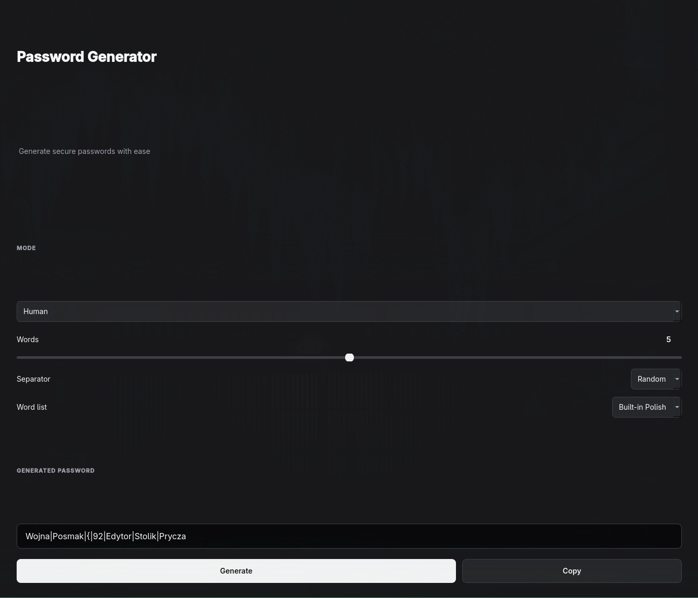

# Password Generator

Password Generator is a secure desktop application for creating random and
human-readable passwords. It provides a PySide6 graphical interface, a
built-in Polish word list and support for custom word lists.

Prebuilt standalone packages run without Python or an activated virtual
environment.

## Features

* Password Manager mode for highly random passwords
* Human mode for readable word-based passwords
* Cryptographically secure randomness using Python's `secrets` module
* Configurable length, character sets, word count and separators
* Built-in Polish word list
* Custom `.txt` word lists
* Optional numbers and special characters
* Copying generated passwords to the clipboard
* Input validation and clear error messages
* Standalone Linux and Windows builds

## Screenshot



## Download

[Download latest release](https://github.com/Franek2009/Password-Generator/releases/latest)

Choose the package for your operating system:

* `PasswordGenerator-linux-x86_64.tar.gz`
* `PasswordGenerator-windows-x86_64.zip`

## Running the Standalone Application

### Linux

Extract the downloaded archive and run the executable:

```bash
tar -xzf PasswordGenerator-linux-x86_64.tar.gz
cd PasswordGenerator
./PasswordGenerator
```

The Linux package is portable. It does not install the application
system-wide, add menu entries or modify system configuration. Keep the
executable together with its `_internal` directory.

### Windows

1. Extract `PasswordGenerator-windows-x86_64.zip` using **Extract All**.
2. Open the extracted `PasswordGenerator` directory.
3. Run `PasswordGenerator.exe`.

Keep `PasswordGenerator.exe` together with its `_internal` directory.

Windows may display a Microsoft Defender SmartScreen warning because the
application is not digitally signed. Review that the package came from this
project's GitHub Releases page before choosing to run it.

## Using the Application

### Password Manager Mode

Password Manager mode generates highly random passwords. The following
character sets can be enabled independently:

* uppercase letters
* lowercase letters
* numbers
* special characters

The password length can be configured from **8 to 64 characters**. At least
one character set must be enabled.

When multiple character sets are selected, the generator guarantees that at
least one character from every selected set is present, provided the requested
length is sufficient.

### Human Mode

Human mode generates more readable passwords from randomly selected words.
The user can configure:

* number of words
* separator
* word list
* numbers
* special characters

Supported separators are `-`, `_`, `.`, space, `/`, `|` and `Random`. When
`Random` is selected, one separator is chosen and used consistently throughout
the generated password.

Words are selected without replacement when the list contains enough entries.
If more words are requested than are available, the remaining words are
selected with replacement. Words are capitalized before they are combined.

Example output:

```text
Rower-Zamek-Las-Kawa42!
```

The exact output is random and changes with every generation.

### Custom Word Lists

Human mode accepts custom UTF-8 `.txt` word lists containing one word per
line:

```text
kot
pies
zamek
rower
las
```

The application validates custom lists and reports missing files, empty lists
and invalid text encoding.

### Clipboard

Select **Copy** to place the generated password in the system clipboard. The
application does not intentionally save the password to a file or database.

## Security

Password generation uses Python's `secrets` module instead of the standard
`random` module. `secrets` is designed for values that need to be
unpredictable, including passwords and security tokens.

Password Manager mode also ensures that every enabled character set is
represented when the configured length permits it.

Generated passwords are not intentionally persisted by the application.
Remember that copying a password places it in the operating system clipboard,
where other applications may be able to read it.

## Limitations

Password Generator:

* does not store generated passwords
* does not synchronize passwords between devices
* is not a password manager
* does not provide automatic updates
* does not include a system-wide installer

Use a dedicated password manager if you need encrypted storage,
synchronization, autofill or account management.

## Development

### Requirements

* Python 3.14+
* PySide6
* pytest and pytest-qt for testing
* PyInstaller for standalone builds

### Setup

Clone the repository:

```bash
git clone git@github.com:Franek2009/Password-Generator.git
cd Password-Generator
```

Create a virtual environment:

```bash
python -m venv .venv
```

Activate it on Linux or macOS:

```bash
source .venv/bin/activate
```

Activate it on Windows:

```powershell
.venv\Scripts\activate
```

Install runtime dependencies:

```bash
python -m pip install -r requirements.txt
```

For development and testing, install:

```bash
python -m pip install -r requirements-dev.txt
```

Run the application from source:

```bash
python main.py
```

### Testing

Run the complete test suite:

```bash
python -m pytest
```

The test suite covers:

* Password Manager and Human modes
* configuration and edge-case validation
* character sets and password lengths
* secure word selection
* built-in and custom word lists
* resource handling for source and bundled execution
* application metadata and icon configuration
* GUI controls and mode switching
* clipboard behaviour
* error handling

Before committing changes, run:

```bash
python -m pytest
git diff --check
git status
```

GitHub Actions runs the automated tests and prepares standalone packages for
Linux x86-64 and Windows x86-64.

### Local Standalone Build

Install the pinned build dependencies:

```bash
python -m pip install -r requirements-build.txt
```

Build from the versioned PyInstaller configuration:

```bash
python -m PyInstaller --noconfirm --clean PasswordGenerator.spec
```

The onedir bundle is written to `dist/PasswordGenerator/`.

## Architecture

The project separates application configuration, password generation,
resource and word-list handling and the graphical interface.

```text
User
  ↓
PySide6 GUI
  ↓
PasswordConfig and validation
  ↓
Password generator
  ├── Password Manager mode → character sets
  └── Human mode → built-in or custom word list
  ↓
Generated password
  ↓
GUI / Clipboard
```

### Project Structure

```text
Password-Generator/
├── .github/workflows/
│   ├── package.yml
│   ├── release.yml
│   └── tests.yml
├── app/
│   ├── application.py
│   ├── config.py
│   ├── generator.py
│   ├── resources.py
│   ├── ui.py
│   └── wordlist.py
├── assets/
│   ├── icon.png
│   ├── icon.svg
│   └── README.md
├── data/
│   ├── words.txt
│   └── README.md
├── tests/
│   ├── test_application.py
│   ├── test_generator.py
│   ├── test_resources.py
│   ├── test_ui.py
│   └── test_wordlist.py
├── main.py
├── PasswordGenerator.spec
├── requirements.txt
├── requirements-build.txt
├── requirements-dev.txt
├── LICENSE
└── README.md
```

`main.py` is the application entry point. `app/config.py` defines password
configuration and validation, while `app/generator.py` contains both generation
modes. `app/wordlist.py` loads built-in and custom lists. `app/resources.py`
resolves files when running from source or a PyInstaller bundle.
`app/application.py` configures application metadata and the runtime icon, and
`app/ui.py` contains the PySide6 interface.

## Built-in Word List

The built-in Polish word list is stored in `data/words.txt`. It is based on the
[diceware-pl](https://github.com/MaciekTalaska/diceware-pl) project by Maciek
Tałaska and is included under the MIT License.

See [`data/README.md`](data/README.md) for source and attribution details.

## License

The Password Generator source code is licensed under the MIT License. See
[`LICENSE`](LICENSE) for the full license text.

## Credits

### Polish word list

The built-in Polish word list is based on
[diceware-pl](https://github.com/MaciekTalaska/diceware-pl)
by Maciek Tałaska.

### Application icon

The application icon was designed for Password Generator.

The lock symbol used in the icon is
[Lock Alt by Amanda Moita](https://inkscape.org/~amandamoita/%E2%98%85lock-alt-svgrepo-com)
and is licensed under
[CC0 1.0](https://creativecommons.org/publicdomain/zero/1.0/).

If you use this project, attribution is appreciated.
